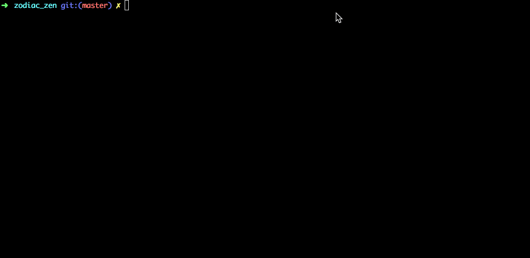

```
          ███████╗ ██████╗ ██████╗ ██╗ █████╗  ██████╗    ███████╗███████╗███╗   ██╗
          ╚══███╔╝██╔═══██╗██╔══██╗██║██╔══██╗██╔════╝    ╚══███╔╝██╔════╝████╗  ██║
            ███╔╝ ██║   ██║██║  ██║██║███████║██║           ███╔╝ █████╗  ██╔██╗ ██║
           ███╔╝  ██║   ██║██║  ██║██║██╔══██║██║          ███╔╝  ██╔══╝  ██║╚██╗██║
          ███████╗╚██████╔╝██████╔╝██║██║  ██║╚██████╗    ███████╗███████╗██║ ╚████║
          ╚══════╝ ╚═════╝ ╚═════╝ ╚═╝╚═╝  ╚═╝ ╚═════╝    ╚══════╝╚══════╝╚═╝  ╚═══╝
                                                                          
```

Zodiac Zen is my first CLI written in python and is to be assessed as our first python assignment for the [Coder Academy](https://coderacademy.edu.au/) Cyber Security bootcamp.  

It's a fun, little app that works out what your star sign is and also what your daily horoscope says. If it's a good one, you can even save it to a text file ☺️

In time, this will be refined with more features and refactored code.




## Clone

- Clone this repo to your local machine using `https://github.com/annehomann/zodiac_zen.git`


## Features

- Find out your star sign!
- Get your daily horoscope!
- Save it to your computer!


## Help File

To install Zodiac Zen you will need <u>pyinstaller</u> installed


Dependencies used are:

- BeautifulSoup (for web scraping)
- Requests (for web scraping - accessing URL)
- Colorama (for styling)
- Datetime (for datestamp)
- Pyinstaller (to install program)
- Pylint (for linting)
- Pytest (for testing)


**How to use Zodiac Zen:**

In your terminal, run the command `python3 zodiac_zen.py`

You will be asked for your name for a personalized experience. Once you are greeted by the program, you will then be displayed the main menu. 

The main menu will give you 3 options:
1) What is my star sign?
2) Receive my daily horoscope
3) Exit


**1) What is my star sign?**
Find out your star sign by using your birth date!

**How do I use it?**
Enter your birth date (using numbers only) and your birth month.
This will give the program enough information to make a calculation and display your star sign.

**2) Receive my daily horoscope**
Get your daily horoscope by entering a star sign. When you get your reading back, you will be asked if you wish to save it. 

**How do I use it?**
Enter a star sign to receive that sign's daily horoscope. You will then be prompted if you wish to save the horoscope reading. Enter Y to save the reading to a text file on your local drive. If you choose not to save it, pressing N will return you to the menu.


## FAQ

- How do I find out my star sign?
  
  - Easy! Just select option 1 in the menu and enter your date of birth and your birth month and Zodiac Zen will work it out for you 
  
- How do I read my daily horoscope?
  
  - Select option 2 in the menu and enter your star sign. This will retrieve your daily reading specific to your star sign
  
- Can I read the daily horoscope for any other star sign?
  
  - Of course you can! You can type in any star sign and get the relevant reading! Show off to your friends 😉
  
- Can I download my reading?
  
  - Definitely. After you get your reading, you will be asked if you want to save a copy. Press Y and you will have a copy in your downloads.
  
- Am I able to access any of the app functions from the outside? Using my own terminal?

  - You sure can. By downloading `zodiac_zen.py` and running `zodiac_zen.py -h` within your terminal, you will be able to access the help menu

    If you wish to access a star sign's daily horoscope, then you can do this by running `zodiac_zen.py -r your_star_sign` or `zodiac_zen.py --reading your_star_sign`

    **Example:** `zodiac_zen.py -r leo` or `zodiac_zen.py --reading leo`

    This will give you your horoscope reading within your terminal window and will also give you the option to save to file.


## Testing

The file `test_zodiac_zen.py` outlines each unit test. The functions tested are web_scrape() and greeting().

test_greeting is to test user input validation, in this case the user's name. This is using the monkeypatch feature which is a part of pytest.

test_web_scrape is to test whether the URL is a valid URL or not. In this test, I purposely mistyped the URL so it returns a 404 error.


## To Work On Next

Following up from this project, these points are what I would like to continue working on and then revisit my code

- Refactor code, possibly making each star sign into it's own separate function? Also maybe using less loops as it gets very confusing.
- Keep learning about unit testing
- Keep learning about Argparse


## License

[](http://badges.mit-license.org/)

- **MIT license**

  ©️ Anne Homann 2019
  
  
